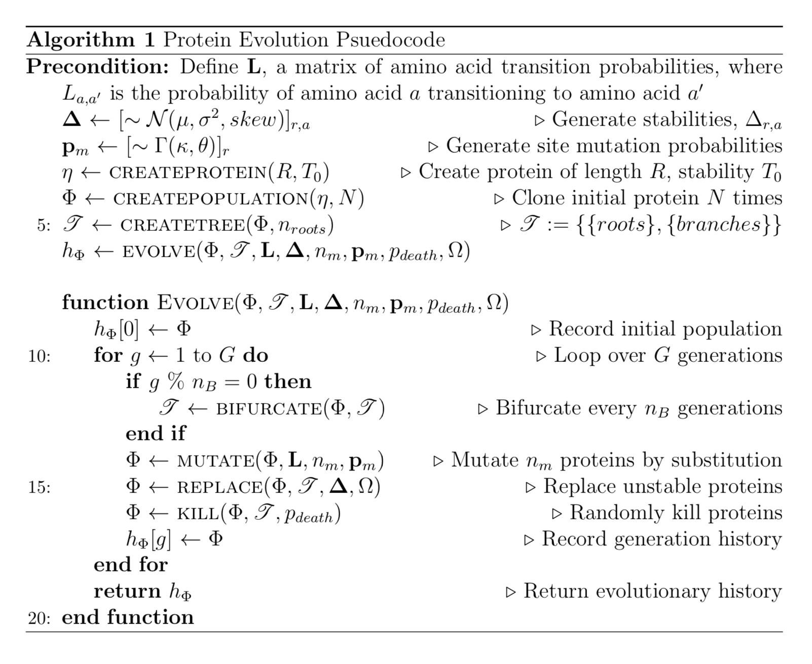
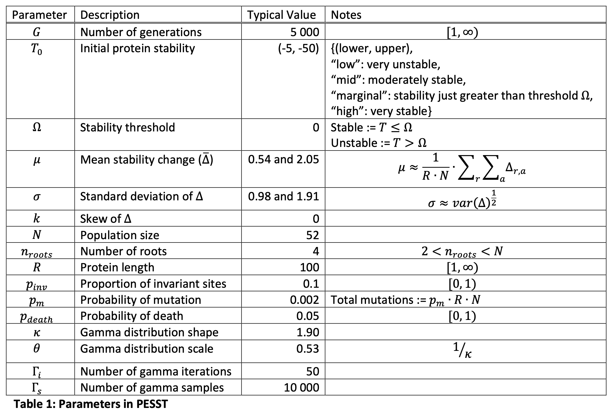

# PESST

**Protein Evolution Simulator with Stability Tracking**

[](https://doi.org/10.1101/2022.11.23.517659)
[](https://github.com/bdevans/PESST/blob/master/LICENSE.txt)

---

PESST is simulation software developed to test the *Survivor Bias Hypothesis* in relation to the reconstruction of ancestral proteins. For examples of how to run the code, see the scripts in the [`examples`](https://github.com/bdevans/PESST/tree/master/examples) folder.

For the accompanying preprint for this model, see:

"Survivor bias drives overestimation of stability in reconstructed ancestral proteins", (2022)
Adam Thomas, Benjamin D. Evans, Mark van der Giezen, Nicholas J. Harmer.
bioRxiv 2022.11.23.517659; [doi:10.1101/2022.11.23.517659](https://doi.org/10.1101/2022.11.23.517659)

```
@article{10.1101/2022.11.23.517659,
	author = {Thomas, Adam and Evans, Benjamin D. and van der Giezen, Mark and Harmer, Nicholas J.},
	title = {Survivor bias drives overestimation of stability in reconstructed ancestral proteins},
	elocation-id = {2022.11.23.517659},
	year = {2022},
	doi = {10.1101/2022.11.23.517659},
	publisher = {Cold Spring Harbor Laboratory},
	abstract = {Ancestral sequence reconstruction has been broadly employed over the past two decades to probe the evolutionary history of life. Many ancestral sequences are thermostable, supporting the ``hot-start'' hypothesis for life's origin. Recent studies have observed thermostable ancient proteins that evolved in moderate temperatures. These effects were ascribed to ``consensus bias''. Here, we propose that ``survivor bias'' provides a complementary rationalisation for ancestral protein stability in alignment-based methods. As thermodynamically unstable proteins will be selected against, ancestral or consensus sequences derived from extant sequences are selected from a dataset biased towards the more stabilising amino acids in each position. We thoroughly explore the presence of survivor bias using a highly parameterizable \textit{in silico} model of protein evolution that tracks stability at the population, protein, and amino acid levels. We show that ancestors and consensus sequences derived from populations evolved under selective pressure for stability throughout their history are significantly biased toward thermostability. Our work proposes a complementary explanation of the origin of thermostability in the burgeoning engineering tools of ancestral sequence reconstruction and consensuses. It provides guidance for the thorough derivation of conclusions from future ancestral sequence reconstruction work.Competing Interest StatementThe authors have declared no competing interest.},
	URL = {https://www.biorxiv.org/content/early/2022/11/25/2022.11.23.517659},
	eprint = {https://www.biorxiv.org/content/early/2022/11/25/2022.11.23.517659.full.pdf},
	journal = {bioRxiv}
}
```

## Tenets of the Survivor Bias Hypothesis

1. The majority of amino acids are destabilising at any given site in a protein.
2. The majority of proteins are marginally stable.
3. Sequence space for contemporary proteins over-represents stabilising or less destabilising amino acids compared to the global distribution.
4. Reconstructions based on contemporary proteins lack information as sequences selected against are absent.

## Model Description

PESST is a protein evolution simulator (summarised in the PESST evolutionary algorithm pseudocode with parameters in the following table) which simulates a fixed population ( $\Phi$ ), of $N$ proteins evolving over $G$ generations. Each protein, $\eta$, consists of $R$ amino acids (methionine followed by $R − 1$ randomly chosen amino acids from 20 candidates) with an associated thermal stability defined as: $T= \sum_{r=1}^{R} \Delta_{r,a_r}$, where $\Delta_{r,a}$ is the change in thermodynamic stability conferred by amino acid $a$ at location $r$ (i.e. “locus $\Delta\Delta G_0$”). The global set of $\Delta_{r,a}$ stability changes are randomly drawn from a distribution based on one or more Gaussians of defined mean, variance and proportion (Tokuriki et al. 2007), with an optional skew, $\sim \mathcal{N}(\mu_n, \sigma^2_n, skew_n, P_n)$. For simplicity epistasis was not modelled since the majority of amino acid stability contributions are approximately additive (Bloom et al. 2005).

The population is initialised with proteins with a defined stability ("High", "Low", "Medium", or within a desired range). Proteins evolve according to a simple uniform clock, with a fixed probability of mutation ( $p_m$ ) for each amino acid in every generation, except for a defined proportion of invariant sites, $p_{invariant}$ to model functionally essential amino acids. Mutation follows the LG model of amino acid substitution (Le and Gascuel 2008), with transition probabilities defined by the matrix $\mathbf{L}$, where $L_{a, a'}$ is the probability that amino acid $a$ transitions to amino acid $a'$, with $a \neq a'$. Mutation probabilities vary across sites in the protein (defined by the vector $\mathbf{m}$) calculated as the median values of four quartiles of 10 000 samples drawn from a gamma distribution after (Yang 1994) such that $m_r\sim \Gamma(\kappa, \theta); \sum_{r=1}^R m_r = 1$. Within each generation, proteins crossing the stability threshold ( $T \gt \Omega$ ) and those randomly selected according to $p_{death}$ are killed and randomly replaced *in populous* by a stable protein generating independent lineages, preventing star phylogenies.

Evolution is simulated with population isolation to mimic bifurcations. The protein population bifurcates every $g_B$ generations into independent subpopulations ( $\Phi_{branches}$ ) which undergo sequence replacement *in populus*. The bifurcation interval is defined as $g_B = \lfloor \frac{G}{\lfloor \log_2(N-n_{roots})-\log_2(3)+1) \rfloor} \rfloor$ such that there are always 3, 4 or 5 proteins left in each branch at the end of the simulation. If every protein in a subpopulation is below the stability threshold, the simulation reverts to the prior generation to re-mutate the sequences and try to avoid complete branch extinction.

PESST continually tracks changes in stability at the amino acid ( $\Delta_{r,a}$ ), protein ( $T$ ) and population ( $\overline{T}_\Phi$ ) levels. From these recorded stabilities, animated figures are produced in addition to statistical analyses and FASTA files for ancestral reconstruction. The model was implemented using Python v3.8 (Van Rossum and Drake 2009) and the code is open source and freely available for download.


*PESST evolutionary algorithm pseudocode*



*Parameters in PESST*




## Initiating a starting sequence
- A protein ( $\eta_{initial}$ ) of user definable length $R$ is formed, containing a  start methionine followed by randomly selected amino acids.
- Each position ( $r$ ) can contain one of 20 amino acids ( $a$ ). From a user definable normal distribution $N$ of mean $\mu$ and variance $\sigma^2$, the model randomly generates a 2D matrix $\mathbf{\Delta}$, where $\Delta_{r,a}$ describes a $\Delta T$ value of a given amino acid at a given position. The stability ( $T$ ) of $\eta$ is given by $T = \sum_{r=1}^{R} \Delta_{r,a_r}$, where $\Delta_{r,a}$ is the change in thermodynamic stability conferred by amino acid $a$ at location $r$.
- In nature, sites become fixed in a population if they are essential for function despite possible detrimental $\Delta T$ values. Therefore, to account for this behaviour, the model defines invariant sites to a proportion of the amino acids in the protein ( $p_{invariant}$ ).
- The user sets a stability threshold ( $\Omega$ ), such that $-\infty \lt \Omega \lt T_0$.
- Natural sequences exhibit rate variation across sites. Rate variation can be modelled to a gamma distribution ( $\Gamma$ ) with four independent rate categories (Yang 1994).
- Independent rate categories are generated each run by taking the median value of four quartiles of 10,000 samples from a gamma distribution of a user defined shape ( $\kappa$ ) and scale. Typically a scale of $\frac{1}{\kappa}$ is used. Each variant position is randomly assigned to one of four rate categories, defining a matrix of site-wise mutation probabilities $m$ (where $m_r\sim \Gamma(\kappa, \theta); \sum_{r=1}^R m_r = 1$), which remains constant throughout the simulation.
- The user sets one of five possible initial $T$ values (low, medium, marginal, [bounded range], high) that modifies $\eta$ into the sequence that will be used for evolution.
  - $T_0^{low}$ and $T_0^{high}$ are treated in the following manner: every site where residues are not fixed is swapped for another amino acid chosen randomly from a pool of the three largest or smallest values of $\Delta_{r,a}$.
  - $T_0^{medium}$ requires the user to input a $T$ range where $T_{min} \gt \Omega$ and $T_{min}$ and $T_{max}$ are between the minimum and maximum bounds of $T = \sum_{r=1}^{R} \Delta_{r,a_r}$. The model then modifies non-fixed residues until the first protein sequence is discovered that satisfies a value in the range by hill-climbing.

## Evolving a sequence
- Once a starting sequence $\eta$ of length $R$, with site-wise mutation probability $\mathbf{m}$, and a global fitness of $T_{max} \ge T \gt \Omega$ has been generated by the model, the sequence is cloned to generate a starting population ( $\Phi$ ) of a user-defined size ( $N$ ).
- The population evolves according to a uniform clock over a user-defined number of generations ( $G$ ). At every generation, each amino acid undergoes mutation with a constant probability $p_m$, where $p_m\cdot R\cdot N$ defines the total number of mutations per generation. $p_m\cdot R\cdot N$ sites are selected to mutate at rates according to $\mathbf{m}$. A site with amino acid a transition to a new amino acid $a'$ based on the Le and Gascuel (LG) amino acid replacement matrix, $\mathbf{L}$ (Le and Gascuel 2008) that is modified so $a \ne a'$.
- A protein’s fitness is considered binary (fit|unfit). Proteins are considered unfit when $T \le \Omega$. Before each generation, the model checks for unfit sequences in $\Phi$. If this is satisfied, $\eta_{unfit}$ is deleted and replaced with another sequence in the population that satisfies $T \ge \Omega$.
- Evolution is simulated with population isolation to mimic bifurcations. In this instance, the model divides the global population into even sub-populations $\Phi_{roots}$ and $\Phi_{branches}$ where $\Phi_{branches}$ split at a bifurcation interval $g_B$ where $g_B = \lfloor \frac{G}{\lfloor \log_2(N-n_{roots})-\log_2(3)+1) \rfloor} \rfloor$. Isolation events occur at equal time-points such that every final population at the end of the run contains 3, 4 or 5 individuals. When an individual in a sub-population dies, it can then only be replaced *in populous*, generating independent lineages. An edge case in this factor required a feature in the model that diverges significantly from nature. If every sequence in a subpopulation of $\Phi$ satisfies $T \lt \Omega$ the entire subpopulation goes extinct. Therefore, the simulation reverts to the prior generation to re-attempt mutating sequences to avoid complete branch extinction.
- If the user desires, evolution can be run assuming death happens naturally in the population, aside from being outcompeted due to fitness. At every generation, each member of $\Phi$ has a user defined probability of dying ( $p_{death}$ ). As before, dead individuals are immediately replaced by other individuals *in populous*. This allows for evolution that occurs without replacement caused by fitness to produce a phylogeny that is not a star-phylogeny.

## Outputs
The model is able to track and output a variety of useful data about the population’s evolution:
- At a user defined generation rate, the model can output FASTA files describing the sequences of $\Phi$.
- A scatter plot describing the change in $T$ of every sequence in $\Phi$ over time.
- At a user defined generation rate, the model will output data, graphs and animations describing every $\Delta_{r,a}$ of each amino acid within $\Phi$ at a given generation compared to $\Delta_{r,a}$ values stored in $\mathbf{\Delta}$. 
- At a user defined generation rate, the model will output data on the distribution of $\Delta T$ values within $\Phi$ ( $\Delta_\Phi$ ), including the Anderson-Darling, Skewness-Kurtosis all, and 2-sided Kolmogrov-Smirnoff statistical tests for normality of the data.
