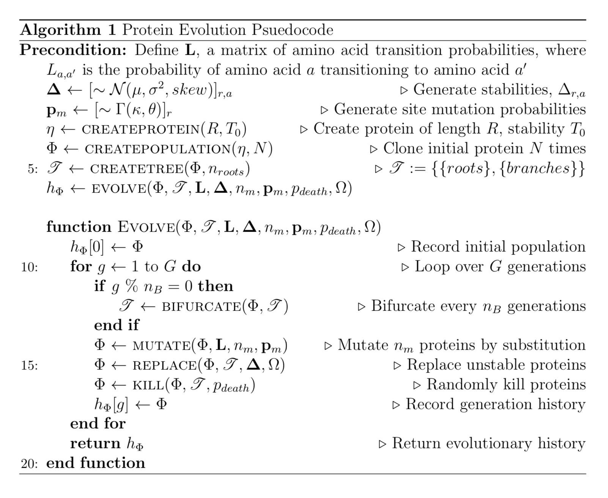
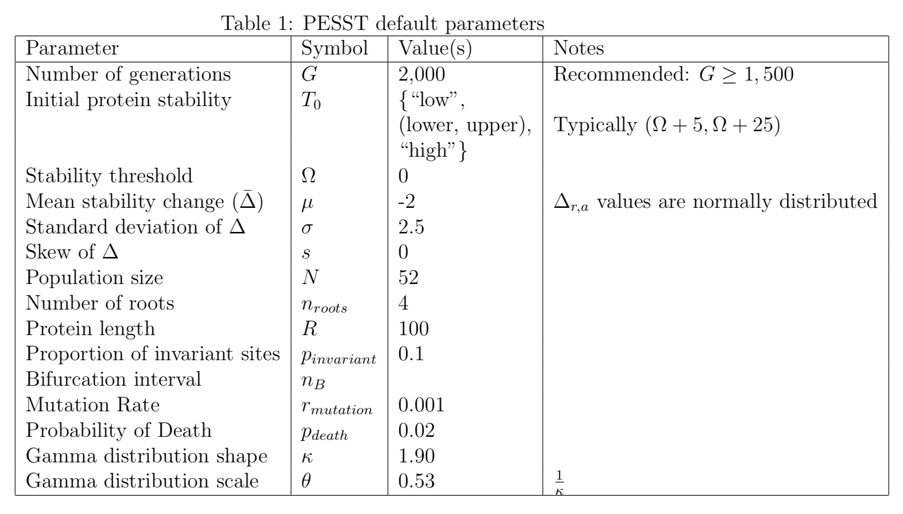

# PESST

Protein Evolution Simulator with Stability Tracking

Tenets of the Survivor Bias Hypothesis
--------------------------------------
1. Stability effects of mutations across a protein are normally distributed with a negative (destabilizing) mean.
2. The majority of proteins are marginally stable.
3. Contemporary proteins contain fewer significantly destabilizing amino acids than ancestral proteins.
4. The sequence space of contemporary proteins is positively biased for stabilizing mutations, despite its mutational landscape.

PESST evolutionary algorithm pseudocode

Default parameters in PESST

## Longer description

Axiom 1 refers only to the nature of the distribution of possible stabilizing effects throughout the protein. Importantly, Axiom 1 then drives Axiom 2, which in turn together drive Axioms 3 and 4. We took this same cascadic approach to the design of a model simulation framework to test these axioms, called Protein Evolution Simulation with Stability Tracking (PESST). By implementing the well evidenced properties defined by Axioms 1 and 2, the validity of subsequent Axioms can be explored. For the exploration of Axiom 1, PESST produces reconstructable, simulated phylogenetic information that has defined stability properties traceable over evolutionary time.

# PESST assumptions

- Proteins evolve in a fixed population size.
- The population derives from a single clone.
- The population evolves according to a uniform clock.
- Time is arbitrary - each generation leads to a fixed number of mutations across the population.
- Protein length does not change over the course of evolution.
- Changes in amino acid sequence only occur by substitution.
- Every amino acid position has an impact on the T_m of its protein.
- Each possible amino acid at every position has a fixed and unique ∆T_m.
- At a given position in a protein, each possible amino acid has a fixed ∆T_m value that remains equivalent for all proteins in the population.
- The distribution of ∆T_m values held by each possible amino acid at each position in the protein sequence is Gaussian.
- ∆T_m values are not epistatic.
- Protein fitness is binary (fit|unfit).
- A protein’s fitness is only derived from its stability in relation to a stability threshold
- A protein is fit until its stability is below the threshold, then it is unfit.
- The penalty for an unfit protein is always death.
- Proteins can duplicate by asexual reproduction, which occurs immediately when there is space in the population to fill.
- As all sequences are equally fit, the protein that undergoes asexual reproduction to fill the space in the population is random.
- Sequences can die randomly.
- A population can bifurcate into even sized sub-populations only.
- Bifurcation occurs at even time periods across the course of evolution.

A simplified version is as follows:

# Initiate a starting sequence
- A protein of user defined length is generated. Each possible amino acid at every position has a ∆T_m value mapped in a matrix based on a Gaussian distribution with user defined mean and shape (Supplementary Figure 1).
- A user defined stability threshold is imposed on the dataset
- Rate variation is defined at every site based on a gamma distribution (Supplementary Figure 2).
- A user defined proportion of sites are fixed as invariant.
- Amino acids are modified until the T_m of the protein satisfies a user defined starting stability – this is Generation 0 for evolution.

# Evolving sequences
- The starting protein is cloned to a user defined population size.
- The population evolves under a uniform clock according the LG model of amino acid substitution (Le and Gascuel 2008; Supplementary Figure 3), with each site changing at a rate defined by the gamma distribution and invariant sites.
- During evolution the model continually tracks changes in stability at both the amino acid (∆T_m) and protein (T_m) level. If a protein drops below the stability threshold it is killed and immediately replaced by another clone.
- During evolution the population bifurcates into independent sub-populations at set time periods. Sub-populations undergo sequence replacement in populous (supplementary figure 4)
- If the user desires, evolution can progress where clones have a user defined probability of dying at each generation to ensure duplication within the population.

Supplementary Methods – a detailed description of PESST
Initiating a starting sequence
- A protein (Ρ) of user definable length l is formed, containing a start methionine followed by randomly generated amino acids.
- Each position (i) can contain one of 20 amino acids (j). From a user definable normal distribution N of mean μ and shape σ^2, the model randomly generates a 2D matrix M, where M_ij describes a ∆T_m value (a) of a given amino acid at a given position. At position i, the state of j is cross-referenced to M to derive a value for a_ij.  The T_m of Ρ is given by ∑▒a_ij  (Supplementary figure 1).
- In nature, sites become fixed in a population if they are essential for function despite possible detrimental ∆T_m values. Therefore, to account for this behaviour, the model assigns an invariant coefficient (I) to every site. Invariant coefficients have a value of 1 if the site is variant, or 0 if the site is invariant. Invariant coefficients are distributed at random at a user definable proportion. Invariant coefficients remain unchanged throughout a simulation.
- The user sets a T_m threshold (Ω), where Ω satisfies -∞<〖Ω<T〗_m^initial.
- Natural sequences exhibit rate variation across sites. Rate variation can be modelled to a gamma distribution (Γ) with four independent rate categories (Yang et al., 1994).
- Independent rate categories are generated each run by taking the median value of four quartiles of 10,000 samples from a gamma distribution of a user defined shape (κ) and scale. Typically a scale of  1/κ is used in models of protein evolution. Each position is randomly assigned to one of four rate categories 〖(Γ〗_i), which remains constant throughout the simulation (Supplementary figure 2).
- The user sets one of three possible starting T_m values (low, medium, high) that modifies P into the sequence that will be used for evolution (Q).
- T_m^low and T_m^highare treated in the following manner: Every site where residues are not fixed is swapped for another amino acid chosen randomly from a pool of the three largest or smallest values of a_ij.
- T_m^med requires the user to input a T_m range defining the minimum and maximum T_m value satisfied by T_m^med  where T_min> Ω and T_min and T_max are between the minimum and maximum values of ∑▒a_ij . The model then randomly and iteratively modifies non-fixed residues until the first protein sequence is discovered that satisfies a value in the range.   
Evolving a sequence
- Once a starting sequence Ρ of length l, with site-wise transition rates IΓ_i, and a global fitness of T_max≥T_m> Ω has been generated by the model, the sequence is cloned to generate a starting population (ϕ) of a user-defined size (S).
- The population evolves according to a uniform clock over a user-defined number of generations (G). At every generation, a set number (λ) of amino acids are destined to change, where λ is constant, and defined as λ = δSl, where δ is the user defined change coefficient. δ describes the proportion of total sites in the dataset (Sl) that will change at every generation. λ sites are selected to mutate at rates according to IΓ_i. Sites transition to a new amino acid based on a modified Le and Gascuel (LG) amino acid replacement matrix (Le and Gascuel, 2008). To ensure that replacements take place at the desired rate, the diagonals in the LG matrix are set to 0, and the remaining rates normalized to give a table of probabilities describing the transition of the chosen amino acid into one of the nineteen other amino acids (Supplementary figure 3).
- Before each generation, the model checks whether the T_m< Ω for each sequence in ϕ. If this is satisfied, ϕ_Ρ is deleted and replaced with another sequence in the population that satisfies T_m> Ω.
- Evolution is simulated with population isolation. In this instance, the model divides the global population into even sub-populations (Supplementary figure 4). When an individual in a sub population dies, it can then only be replaced in populous, generating independent lineages. Isolation events occur at equal time-points such that every final population at the end of the run contains 2<n<6 individuals. Undertaking isolation mimics bifurcations in nature, giving better defined phylogenies when reconstructing phylogenies from output data. Additionally, if desired, a sub-population ϕ_roots of size n≥3 can be isolated at G_0 that replaces sequences in populous and undertakes no further isolation events, mimicking an outgroup population. An edge case in this factor required a feature in the model that diverges significantly from nature. If every sequence in a subpopulation of ϕ satisfies T_m< Ω the entire subpopulation goes extinct. Therefore, to avoid losing sequence diversity, the simulation reverts to the prior generation to re-attempt mutating sequences to avoid complete branch extinction.
- If the user desires, evolution can be run assuming death happens naturally in the population, aside from being outcompeted due to fitness. At every generation, each member of ϕ has a user defined probability of dying (D). As before, dead individuals are immediately replaced by other individuals in populous. This allows for evolution that occurs without replacement caused by fitness to produce a phylogeny that is not a star-phylogeny.

Outputs
The model is able to track and output a variety of useful data about the population’s evolution:
- At a user defined generation rate, the model can output FASTA files describing the sequences of ϕ.
- A scatter plot describing the change in T_m of every sequence in ϕ over time.
- At a user defined generation rate, the model will output data, graphs and gifs describing the every ∆T_m of each amino acid within ϕ.
- At a user defined generation rate, the model will output data on the distribution of ∆T_m values within ϕ, including the Anderson-Darling, Skewness-Kurtosis all, and 2-sided Kolmogrov-Smirnoff statistical tests for normality of the data.
